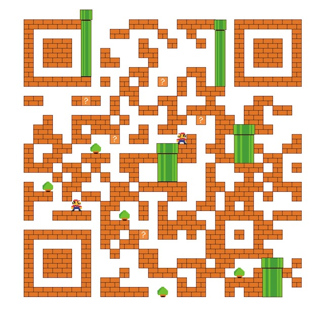

# LeetCode

## 介绍

leetcode 题解，记录自己的 leetcode 升级过程， 目前包含了前100道题目。

每道题目都有多种解法，每个人都有自己的哈姆雷特，本project中的方法也非最优，欢迎👏讨论。

> 只有熟练掌握基础的数据结构与算法，才能对复杂问题迎刃有余。

## 算法与数据结构 

其中算法，主要是以下几种：

- 基础技巧：分治、二分、贪心
- 排序算法：快速排序、归并排序、计数排序
- 搜索算法：回溯、递归、深度优先遍历，广度优先遍历，二叉搜索树等
- 图论：最短路径、最小生成树
- 动态规划：背包问题、最长子序列

数据结构，主要有如下几种：

- 数组与链表：单 / 双向链表
- 栈与队列
- 哈希表
- 堆：最大堆 ／ 最小堆
- 树与图：最近公共祖先、并查集
- 字符串：前缀树（字典树） ／ 后缀树

[source](https://github.com/azl397985856/leetcode/blob/master/README.md)

## Top题目进度

|id|go-version|title|diffc| 
 |:-----: |:-----:|:-----:|:-----:|
|1|🤔|[两数之和](https://leetcode-cn.com/problems/two-sum)|简单|
|2|✅|[两数相加](https://leetcode-cn.com/problems/add-two-numbers)|中等|
|3|✅|[无重复字符的最长子串](https://leetcode-cn.com/problems/longest-substring-without-repeating-characters)|中等|
|4|🤔|[寻找两个有序数组的中位数](https://leetcode-cn.com/problems/median-of-two-sorted-arrays)|困难|
|5|✅|[最长回文子串](https://leetcode-cn.com/problems/longest-palindromic-substring)|中等|
|6|✅|[Z 字形变换](https://leetcode-cn.com/problems/zigzag-conversion)|中等|
|7|🤔|[整数反转](https://leetcode-cn.com/problems/reverse-integer)|简单|
|8|✅|[字符串转换整数 (atoi)](https://leetcode-cn.com/problems/string-to-integer-atoi)|中等|
|9|🤔|[回文数](https://leetcode-cn.com/problems/palindrome-number)|简单|
|10|🤔|[正则表达式匹配](https://leetcode-cn.com/problems/regular-expression-matching)|困难|
|11|✅|[盛最多水的容器](https://leetcode-cn.com/problems/container-with-most-water)|中等|
|12|✅|[整数转罗马数字](https://leetcode-cn.com/problems/integer-to-roman)|中等|
|13|🤔|[罗马数字转整数](https://leetcode-cn.com/problems/roman-to-integer)|简单|
|14|✅|[最长公共前缀](https://leetcode-cn.com/problems/longest-common-prefix)|简单|
|15|✅|[三数之和](https://leetcode-cn.com/problems/3sum)|中等|
|16|✅|[最接近的三数之和](https://leetcode-cn.com/problems/3sum-closest)|中等|
|17|✅|[电话号码的字母组合](https://leetcode-cn.com/problems/letter-combinations-of-a-phone-number)|中等|
|18|✅|[四数之和](https://leetcode-cn.com/problems/4sum)|中等|
|19|✅|[删除链表的倒数第N个节点](https://leetcode-cn.com/problems/remove-nth-node-from-end-of-list)|中等|
|20|✅|[有效的括号](https://leetcode-cn.com/problems/valid-parentheses)|简单|
|21|✅|[合并两个有序链表](https://leetcode-cn.com/problems/merge-two-sorted-lists)|简单|
|22|✅|[括号生成](https://leetcode-cn.com/problems/generate-parentheses)|中等|
|23|🤔|[合并K个排序链表](https://leetcode-cn.com/problems/merge-k-sorted-lists)|困难|
|24|✅|[两两交换链表中的节点](https://leetcode-cn.com/problems/swap-nodes-in-pairs)|中等|
|25|🤔|[k个一组翻转链表](https://leetcode-cn.com/problems/reverse-nodes-in-k-group)|困难|
|26|✅|[删除排序数组中的重复项](https://leetcode-cn.com/problems/remove-duplicates-from-sorted-array)|简单|
|27|✅|[移除元素](https://leetcode-cn.com/problems/remove-element)|简单|
|28|✅|[实现strStr()](https://leetcode-cn.com/problems/implement-strstr)|简单|
|29|✅|[两数相除](https://leetcode-cn.com/problems/divide-two-integers)|中等|
|30|🤔|[串联所有单词的子串](https://leetcode-cn.com/problems/substring-with-concatenation-of-all-words)|困难|
|31|✅|[下一个排列](https://leetcode-cn.com/problems/next-permutation)|中等|
|32|🤔|[最长有效括号](https://leetcode-cn.com/problems/longest-valid-parentheses)|困难|
|33|✅|[搜索旋转排序数组](https://leetcode-cn.com/problems/search-in-rotated-sorted-array)|中等|
|34|✅|[在排序数组中查找元素的第一个和最后一个位置](https://leetcode-cn.com/problems/find-first-and-last-position-of-element-in-sorted-array)|中等|
|35|✅|[搜索插入位置](https://leetcode-cn.com/problems/search-insert-position)|简单|
|36|✅|[有效的数独](https://leetcode-cn.com/problems/valid-sudoku)|中等|
|37|🤔|[解数独](https://leetcode-cn.com/problems/sudoku-solver)|困难|
|38|✅|[报数](https://leetcode-cn.com/problems/count-and-say)|简单|
|39|✅|[组合总和](https://leetcode-cn.com/problems/combination-sum)|中等|
|40|✅|[组合总和 II](https://leetcode-cn.com/problems/combination-sum-ii)|中等|
|41|🤔|[缺失的第一个正数](https://leetcode-cn.com/problems/first-missing-positive)|困难|
|42|🤔|[接雨水](https://leetcode-cn.com/problems/trapping-rain-water)|困难|
|43|✅|[字符串相乘](https://leetcode-cn.com/problems/multiply-strings)|中等|
|44|🤔|[通配符匹配](https://leetcode-cn.com/problems/wildcard-matching)|困难|
|45|🤔|[跳跃游戏 II](https://leetcode-cn.com/problems/jump-game-ii)|困难|
|46|✅|[全排列](https://leetcode-cn.com/problems/permutations)|中等|
|47|🤔|[全排列 II](https://leetcode-cn.com/problems/permutations-ii)|中等|
|48|✅|[旋转图像](https://leetcode-cn.com/problems/rotate-image)|中等|
|49|✅|[字母异位词分组](https://leetcode-cn.com/problems/group-anagrams)|中等|
|50|✅|[Pow(x, n)](https://leetcode-cn.com/problems/powx-n)|中等|
|51|🤔|[N皇后](https://leetcode-cn.com/problems/n-queens)|困难|
|52|🤔|[N皇后 II](https://leetcode-cn.com/problems/n-queens-ii)|困难|
|53|🤔|[最大子序和](https://leetcode-cn.com/problems/maximum-subarray)|简单|
|54|✅|[螺旋矩阵](https://leetcode-cn.com/problems/spiral-matrix)|中等|
|55|✅|[跳跃游戏](https://leetcode-cn.com/problems/jump-game)|中等|
|56|✅|[合并区间](https://leetcode-cn.com/problems/merge-intervals)|中等|
|57|🤔|[插入区间](https://leetcode-cn.com/problems/insert-interval)|困难|
|58|🤔|[最后一个单词的长度](https://leetcode-cn.com/problems/length-of-last-word)|简单|
|59|✅|[螺旋矩阵 II](https://leetcode-cn.com/problems/spiral-matrix-ii)|中等|
|60|✅|[第k个排列](https://leetcode-cn.com/problems/permutation-sequence)|中等|
|61|✅|[旋转链表](https://leetcode-cn.com/problems/rotate-list)|中等|
|62|🤔|[不同路径](https://leetcode-cn.com/problems/unique-paths)|中等|
|63|✅|[不同路径 II](https://leetcode-cn.com/problems/unique-paths-ii)|中等|
|64|✅|[最小路径和](https://leetcode-cn.com/problems/minimum-path-sum)|中等|
|65|🤔|[有效数字](https://leetcode-cn.com/problems/valid-number)|困难|
|66|🤔|[加一](https://leetcode-cn.com/problems/plus-one)|简单|
|67|🤔|[二进制求和](https://leetcode-cn.com/problems/add-binary)|简单|
|68|🤔|[文本左右对齐](https://leetcode-cn.com/problems/text-justification)|困难|
|69|🤔|[x 的平方根](https://leetcode-cn.com/problems/sqrtx)|简单|
|70|✅|[爬楼梯](https://leetcode-cn.com/problems/climbing-stairs)|简单|
|71|✅|[简化路径](https://leetcode-cn.com/problems/simplify-path)|中等|
|72|🤔|[编辑距离](https://leetcode-cn.com/problems/edit-distance)|困难|
|73|✅|[矩阵置零](https://leetcode-cn.com/problems/set-matrix-zeroes)|中等|
|74|✅|[搜索二维矩阵](https://leetcode-cn.com/problems/search-a-2d-matrix)|中等|
|75|✅|[颜色分类](https://leetcode-cn.com/problems/sort-colors)|中等|
|76|✅|[最小覆盖子串](https://leetcode-cn.com/problems/minimum-window-substring)|困难|
|77|✅|[组合](https://leetcode-cn.com/problems/combinations)|中等|
|78|✅|[子集](https://leetcode-cn.com/problems/subsets)|中等|
|79|✅|[单词搜索](https://leetcode-cn.com/problems/word-search)|中等|
|80|✅|[删除排序数组中的重复项 II](https://leetcode-cn.com/problems/remove-duplicates-from-sorted-array-ii)|中等|
|81|✅|[搜索旋转排序数组 II](https://leetcode-cn.com/problems/search-in-rotated-sorted-array-ii)|中等|
|82|✅|[删除排序链表中的重复元素 II](https://leetcode-cn.com/problems/remove-duplicates-from-sorted-list-ii)|中等|
|83|✅|[删除排序链表中的重复元素](https://leetcode-cn.com/problems/remove-duplicates-from-sorted-list)|简单|
|84|🤔|[柱状图中最大的矩形](https://leetcode-cn.com/problems/largest-rectangle-in-histogram)|困难|
|85|🤔|[最大矩形](https://leetcode-cn.com/problems/maximal-rectangle)|困难|
|86|✅|[分隔链表](https://leetcode-cn.com/problems/partition-list)|中等|
|87|🤔|[扰乱字符串](https://leetcode-cn.com/problems/scramble-string)|困难|
|88|✅|[合并两个有序数组](https://leetcode-cn.com/problems/merge-sorted-array)|简单|
|89|✅|[格雷编码](https://leetcode-cn.com/problems/gray-code)|中等|
|90|✅|[子集 II](https://leetcode-cn.com/problems/subsets-ii)|中等|
|91|🤔|[解码方法](https://leetcode-cn.com/problems/decode-ways)|中等|
|92|🤔|[反转链表 II](https://leetcode-cn.com/problems/reverse-linked-list-ii)|中等|
|93|🤔|[复原IP地址](https://leetcode-cn.com/problems/restore-ip-addresses)|中等|
|94|🤔|[二叉树的中序遍历](https://leetcode-cn.com/problems/binary-tree-inorder-traversal)|中等|
|95|🤔|[不同的二叉搜索树 II](https://leetcode-cn.com/problems/unique-binary-search-trees-ii)|中等|
|96|🤔|[不同的二叉搜索树](https://leetcode-cn.com/problems/unique-binary-search-trees)|中等|
|97|🤔|[交错字符串](https://leetcode-cn.com/problems/interleaving-string)|困难|
|98|🤔|[验证二叉搜索树](https://leetcode-cn.com/problems/validate-binary-search-tree)|中等|
|99|🤔|[恢复二叉搜索树](https://leetcode-cn.com/problems/recover-binary-search-tree)|困难|
|100|✅|[相同的树](https://leetcode-cn.com/problems/same-tree)|简单|

## 微信
 

## 贡献

- 如果有想法和创意，请提[issue](https://github.com/zhaozy93/leetcode_go/issues)
- 如果想贡献代码，请提[PR](https://github.com/zhaozy93/leetcode_go/pulls)
